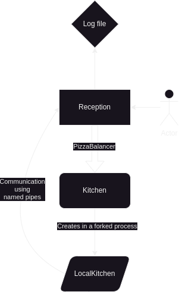

# The Plazza

## Project description

Mama mia! The Plazza is a software that manages the pizza cooking process. The software is composed of two main components: the reception and the kitchen. The reception is responsible for receiving orders from the user and sending them to the kitchen. The kitchen is responsible for cooking the pizzas and sending them back to the reception.

## How it works

Infrastructure diagram:

### Reception

The reception is here to receive orders from the user. It is a simple command line interface that allows the user to input orders. After receiving an order, the reception uses the pizza balancer to attribute the pizza(s) the according kitchen(s). If no kitchen is found, the reception will create a new kitchen. The reception will then send the order to the kitchen(s) using our defined FIFO strategy.

### Kitchen

The kitchen is the place where the pizzas are cooked. Each kitchen has a certain number of cooks and a certain number of slots. The cooks are responsible for cooking the pizzas and the slots are responsible for storing the pizzas. The kitchen will receive orders from the reception and will cook them in the order they were received. The kitchen will then send the cooked pizzas back to the reception.

Each kitchen has a specific amount of resources (stock) that it can use to cook pizzas. The kitchen will use these resources to cook the pizzas. If the kitchen does not have enough resources to cook a pizza, it will wait until it has enough resources to cook the pizza.

## Design decisions

### Named pipes

We use named pipes to communicate between the reception and the kitchen. This is because named pipes are a simple way to communicate between processes. They are also easy to use and can be used in a similar way to files. This makes them a good choice for our project because we can easily write to them and read from them. It is also a good way to keep track of which information is sent or not, because when writing to a named pipe, the process will block until the other process reads from it.

### Usage of `binary_semaphore` instead of `mutex`

In the program, we often use `binary_semaphore` instead of `mutex` because semaphores are useful for their ability to queue acquire requests. Whereas the mutex does not guarantee that the first thread that tries to acquire the lock will be the first to acquire it, the semaphore does. This is useful for us because if we want to queue pizzas in a certain order, we can use semaphores to ensure that the pizzas are processed in the order they were received.

### Usage of singletons

Singletons are used in the logger and arguments components. We use them because they allow us to have a single instance of a class that is shared across the program. This is useful for us because we only need one instance of the logger and arguments components. This allows us to easily access these components from anywhere in the program.